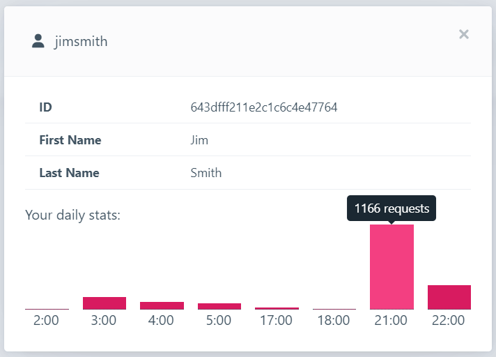

# Web Application Development Final Project
## Threaded Socket Chat App

### Notable inclusions:
- User authorization
- User registration
- User login
- Active user view/log
- Activity statistics
- Message sending and receiving

### What Are We Using?
- MongoDB
- SVG and HTML
- CSS and CSS frameworks
- JavaScript, jQuery, D3
- DHTML
- AJAX, web services
- Node.js
- Views and/or client-side framework

### What is our goal?

We intended to design a web application that would allow numerous connected users to send and receive messages. Our application offers both light and dark chat window modes, the creation and storing of users with unique usernames and passwords, and a running log of signed in and active users, as well as statistics similar to those seen in a bigger, more robust application.

### What is the intended use of our application?

The app is designed to serve as a direct communication channel for any connected users who run the application on the same port. It is basic yet functional, and it was created with the user's convenience in mind.

## Special Instructions for Execution

// baseplate incase there is something needed, will be deleted otherwise//

It is important that users have the neccessary requirements installed properly on their system to run our app and all of it's features. Here is a list of requirements that our app needs:

- 
- 

## How to Execute the Application

//steps go here//

## Demonstration

Below is a demonstration video showing the features of our application.

Below is an image of the user stats page demonstrating the activity log.

## Contributors

- Fejiro-A
- jonahbaayen (incl. nyuppo)
- illxso
- Cameron-Millar 
- Omar-Husain
- jordanhklam
